# 总览
本文讨论了一种新的缓存策略，意在基于现有kidsloop2项目，在尽可能小的改动下，实现较好的缓存方案。通用缓存策略kl-cache是一种通用平台无关的基于key-value的缓存解决方案，它解决了多表慢查询问题，具有精确缓存，高效和失效即时反馈的特点。


# 慢查询问题
我们调研kidsloop2的表查询时，发现kidsloop2中的表查询具有以下两个特点：

- 单表复杂查询
- 多表依赖

查询条件复杂指在kidsloop2进行表查询时，存在很多针对单表的复杂查询，kidsloop2中的很多业务表如schedules支持较复杂条件查询。另一个重要的特征时多表依赖问题，由于业务表中包含着大量其他表的id，存在大量表依赖关系。在进行一次单表复杂查询后，kidsloop2会根据查到的信息对多个表进行id查询。


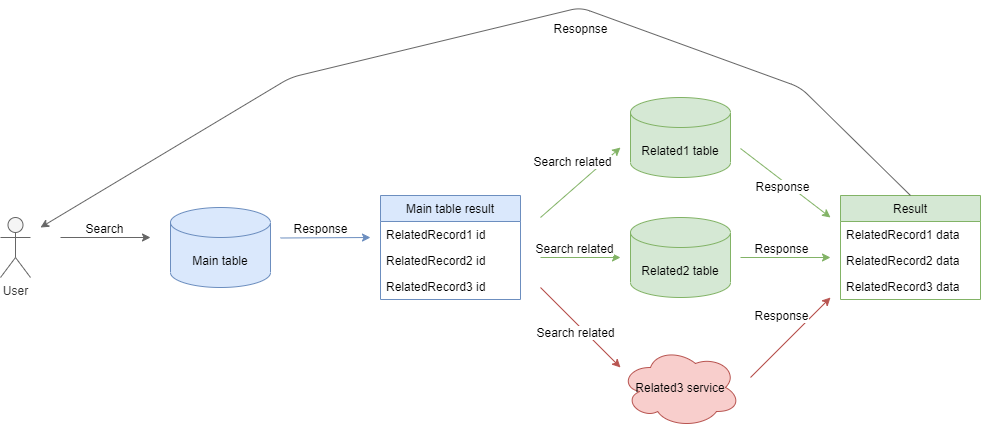
这是kidsloop2查询的一个重要形式，根据我们的调研，我们发现，花费时间较长的不是第一次复杂表查询，而是**第二次表关联查询**，基于这个结论，我们将kl-cache缓存优化的重点放在第二次查询中。
# 缓存策略
## 前提条件
所有数据表必须**显式**包含一个主键。
## 缓存引擎
理论上kl-cache支持所有key-value结构的数据存储引擎。

| **#** | **缓存引擎** |
| ----- | ------------ |
| 1     | redis        |
| 2     | 本地内存     |

## 缓存数据结构
我们使用key-value结构的缓存，缓存包括两种数据结构，即entry cache和related cache。数据结构定义如下：

| **数据结构** | **entry cache**            | **related cache**          |
| ------------ | -------------------------- | -------------------------- |
| **数据类型** | string                     | list                       |
| **前缀**     | klc:cache:entry            | klc:cache:related          |
| **键**       | [prefix]:[table_name]:[id] | [prefix]:[table_name]:[id] |
| **值**       | json结构的数据             | 关联的key列表[id1,id2...]  |

## 两阶段查询
介于kidsloop2的第一次查询条件较为复杂，我们建议采用数据库索引的方式对第一次复杂查询进行优化，关于数据库索引优化，不在本文探讨范围。
我们重点优化第二次查询，我们采用两阶段查询的方式对第二次查询进行优化，其步骤如下：

1. 根据复杂查询条件，查询数据库，本次查询只查询复合查询条件的**记录id**。
1. 通过id查询缓存中命中的记录，记为resultA
1. 筛出所有未命中缓存的id，记为idSetA
1. 使用主键查询数据库中的所有idSetA数据，记为resultB
1. 关联查询时，优先查询缓存中的记录，缓存不存在则查询数据库
1. 将从数据库中查询的结果保存在缓存中
1. 拼装resultA与resultB作为result返回

两阶段查询的流程图如下所示：
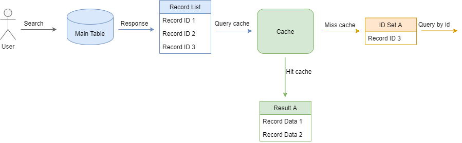


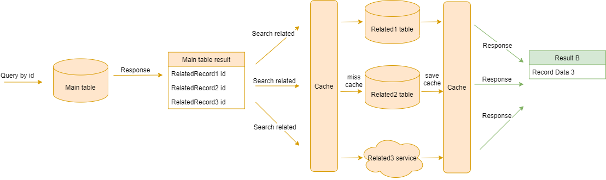


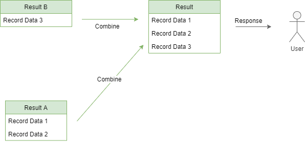


## 关联失效
kl-cache中缓存失效的时间默认为**5分钟**，失效缓存我们采用**双删**策略。双删策略步骤如下：

1. 根据id删除缓存
1. 等待5s
1. 再次根据id删除缓存
### 关联缓存失效问题
为了防止关联数据失效，我们必须记录数据之间的关联关系。否则，当关联数据失效，而查询数据未失效的情况下，会出现缓存错误的问题。
如下图所示，在DataA中包含DataB和DataC的id，当我们缓存DataA时，我们会缓存DataB和DataC的数据。

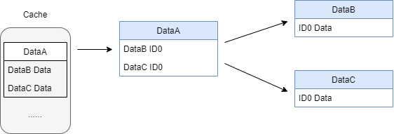

当DataB发生变化时，缓存中的DataB并没有更新，造成数据错误。

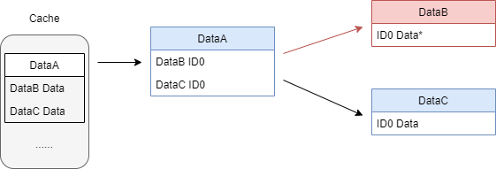

### 缓存存储策略
在存储缓存时，其步骤如下：

1. 保存缓存数据到entry中
1. 保存缓存关联数据到related中


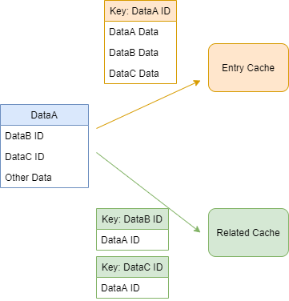
### 缓存失效策略
在缓存失效时，例如修改或删除某个数据时，其步骤如下：

1. 根据id删除entry中的数据
1. 根据id查询related中的数据
1. 删除related中的关联缓存
1. 根据id删除related中的数据

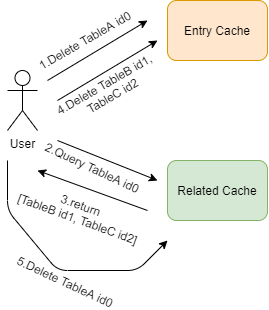


## *多阶梯缓存
对于某些高频访问的数据，我们可以采用多阶梯缓存策略，本地缓存直接保存在宿主机的内存中，本地内存仅保存最高频访问的数据，若命中本地缓存，直接返回，减少通信开销。
若未命中本地缓存，则查询远程缓存（redis等），若远程缓存中存在，则直接返回。
若远程缓存中不存在，则查询数据库。

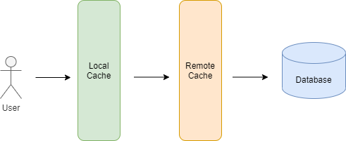


# 优化效果
## 理论效果
为了方便展示理论效果，我们假设数据库复杂查询需要耗时50ms，id查询耗时20ms，缓存查询耗时10ms，缓存添加删除耗时5ms。复杂查询数据库所有内容和复杂查询数据库id的耗时差异忽略不计。

| **操作**           | **耗时（ms）** |
| ------------------ | -------------- |
| 复杂条件查询数据库 | 50             |
| 按id查询数据库     | 20             |
| 写数据库           | 20             |
| 查询缓存           | 10             |
| 写缓存             | 5              |
| 删除缓存           | 5              |

带缓存的数据查询中，会遇到不同场景，如数据命中缓存，数据未命中缓存等，我们根据场景不同，分别计算时间，这里假设查询数据X，X包含**5个关联查询**。

| **场景**                            | **无缓存耗时** | **有缓存耗时** | **缓存操作**                                        |
| ----------------------------------- | -------------- | -------------- | --------------------------------------------------- |
| 直接命中缓存                        | 150ms          | 60ms           | 复杂条件查询 + 查询缓存                             |
| 未命中缓存，全部命中关联缓存        | 150ms          | 135ms          | 复杂条件查询 + 查询缓存 * 6 + 写缓存 + 按id查询     |
| 未命中缓存，部分命中关联缓存（2个） | 150ms          | 130ms          | 复杂条件查询 + 查询缓存 * 6 + 写缓存 + 按id查询 * 3 |
| 未命中缓存，未命中关联              | 150ms          | 235ms          | 复杂条件查询 + 查询缓存 * 6 + 写缓存 + 按id查询 * 6 |
| 写数据库                            | 20ms           | 35ms           | 写数据库 + 查询缓存 + 删除缓存                      |

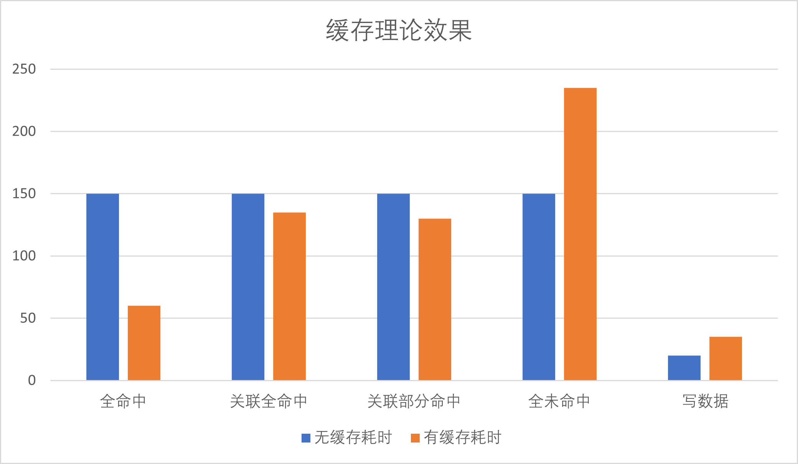
在上表中我们可以看出，在查询数据时，只有在全部未命中缓存时，效率比无缓存低，其他操作有缓存都比无缓存效率更高，且在高频查询情景下，全部未命中缓存的场景出现概率非常低。写数据库本身较查询是低频操作，且耗时在可控范围内。

## 实际效果
### 测试数据结构
为了验证缓存效果,我们建立了一个测试数据库,并建立了5张表，分别为record_a，record_b，record_c，record_d和record_e。
表结构如下所示：

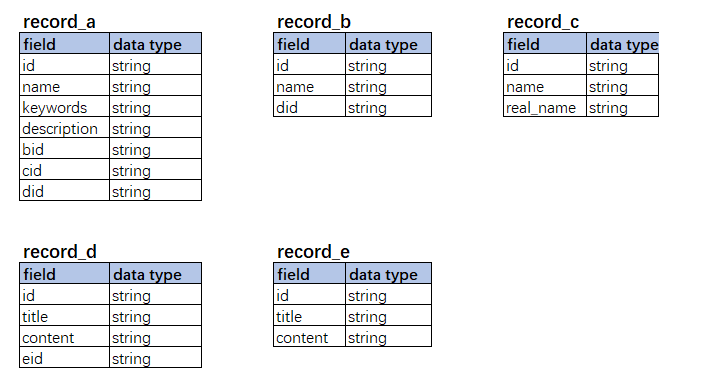

从表结构中我们可以看到，表与表之间存在包含关系，record_a中包含record_b，record_c和record_d的记录，record_b表中包含record_d的记录，record_d中包含record_e的记录。
因此，在查询record_a时，我们需要对record_b，record_c和record_d做关联查询，同理在查询record_b时，要对record_d做关联查询，查询record_d时要对record_e做关联查询。

### 测试数据准备
为了测试，我们在record_a，record_b，record_c，record_d和record_e表中各添加了**10000条记录**，并对关联表做了随机关联。
### 测试场景
为了能够体现缓存对**关联查询**的优化，我们设计了三组查询场景，对record_a的查询，对record_b的查询和对record_c的查询。在查询record_a时我们可以观察到多表关联时缓存的表现情况，在查询record_b时，我们可以观察到单表关联的情况，而查询record_c则可以观察无关联的情况。
为了消除单次查询可能出现的波动，我们采用10轮查询，记录累加时间的实验方式。

| **表名** | **关联表数** |
| -------- | ------------ |
| record_a | 3            |
| record_b | 1            |
| record_c | 0            |

缓存失效时，kl-cache需要做清除缓存的工作，我们也设计了对清除缓存工作的实验，即在删除相同数据量的情况下，加缓存和不加缓存的耗时对比。
因此我们的测试场景如下：

| **场景** | **轮数** | **场景说明**                |
| -------- | -------- | --------------------------- |
| #1       | 10       | 根据name查询RecordA的数据   |
| #2       | 10       | 根据name查询RecordB的数据   |
| #3       | 10       | 根据name查询RecordC的数据   |
| #4       | 1        | 根据name删除RecordA中的记录 |

### 实验结果
我们对4各场景进行了测试，并在多次测试结果做了平均值运算，其结果如下表所示：

| **场景** | **数据库搜索** | **部分命中** | **全命中** | **全未命中** |
| -------- | -------------- | ------------ | ---------- | ------------ |
| #1       | 544.995ms      | 502.249ms    | 260.948ms  | 527.295ms    |
| #2       | 298.095ms      | 377.489ms    | 288.494ms  | 275.87ms     |
| #3       | 128.998ms      | 237.112ms    | 167.421ms  | 129.548ms    |
| #4       | 9.0166ms       | 7.3426ms     | 7.3426ms   | 7.3426ms     |

实验结果基本和我们预测的一致，在多表关联时，全命中缓存会提升1倍的查询效率，而部分命中或未命中缓存效率较低，与数据库搜索相当。
而数据更新，由于我们采用异步清除数据的方式对效率进行优化，因此使用缓存并没有明显的多余耗时。
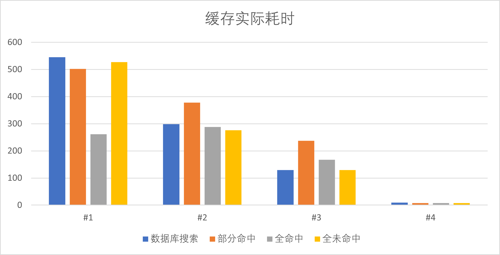

# 如何接入缓存
kl-cache尽可能保证低侵入，要接入缓存，需要实现两个接口，即Object接口和IQuerier接口。
```go
    //Condition querier
    type IConditionQuerier interface{
        QueryForIDs(ctx context.Context, condition dbo.Conditions) ([]string, error)
    }
    
    //Querier
    type IQuerier interface {
        BatchGet(ctx context.Context, ids []string) ([]Object, error)
        ID() string
    }
    //Object
    type Object interface {
        StringID() string
        RelatedIDs() map[string][]string
    }
```
	所有要缓存的数据都要实现Object接口，该接口包含两个函数，StringID()方法返回Object的id，RelatedIDs返回关联数据id，key为关联数据对应的querier的id。

| **函数名** | **说明**                                                             |
| ---------- | -------------------------------------------------------------------- |
| StringID   | 返回Object的id                                                       |
| RelatedIDs | 返回关联数据的id，其中key为关联数据querier name，value为关联的id列表 |

**若一类数据要缓存，则其关联数据也必须缓存，否则无法保证关联失效。**
IQuerier为查询接口，其函数说明如下：

| **函数名**      | **说明**                                         |
| --------------- | ------------------------------------------------ |
| QueryForIDs     | 根据条件查询Object，返回Object的id列表           |
| BatchGet        | 根据Object的id获取完整Object信息（包括关联数据） |
| UnmarshalObject | 解析Object的json格式                             |
| ID              | 返回Object的ID                                   |


最后，在查询数据时，使用CacheEngine进行查询，CacheEngine定义如下：

```go
type ICacheEngine interface {
	Query(ctx context.Context, querierName string, condition dbo.Conditions, result *[]Object) error
	Clean(ctx context.Context, querierName string, ids []string) error
	BatchGet(ctx context.Context, querierName string, ids []string, result interface{}) error
    
	SetExpire(ctx context.Context, duration time.Duration)
	AddQuerier(ctx context.Context, querier IQuerier)
}
```
其中AddQuerier在系统启动时，将所有Querier加入引擎中。

| **函数名** | **说明**                         |
| ---------- | -------------------------------- |
| Query      | 查询数据                         |
| Clean      | 清楚缓存（更新和删除数据时调用） |
| AddQuerier | 系统添加Querier                  |


